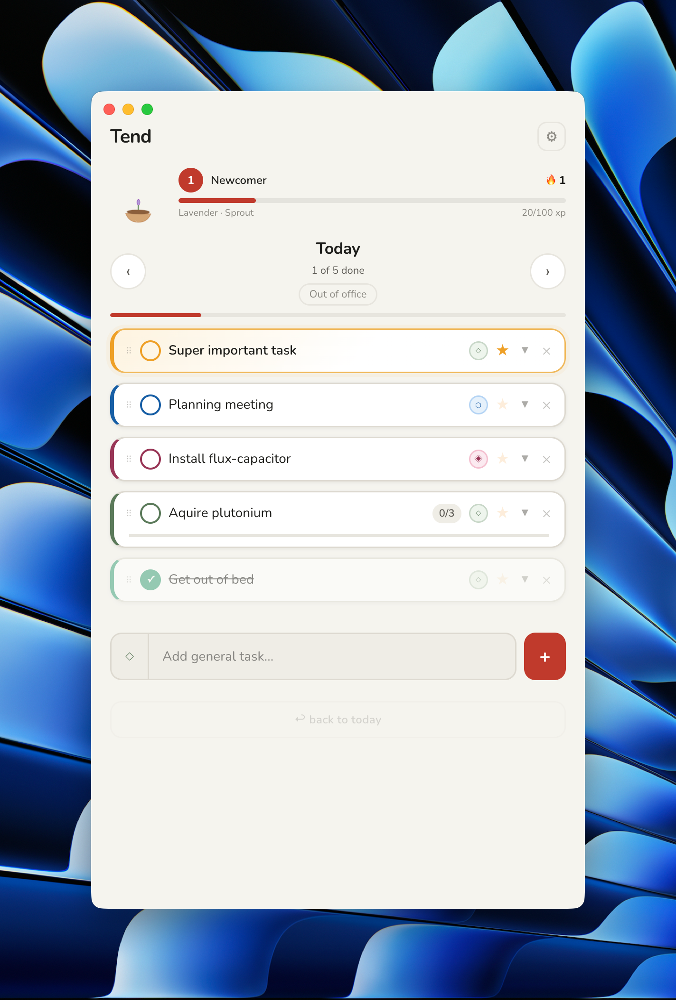
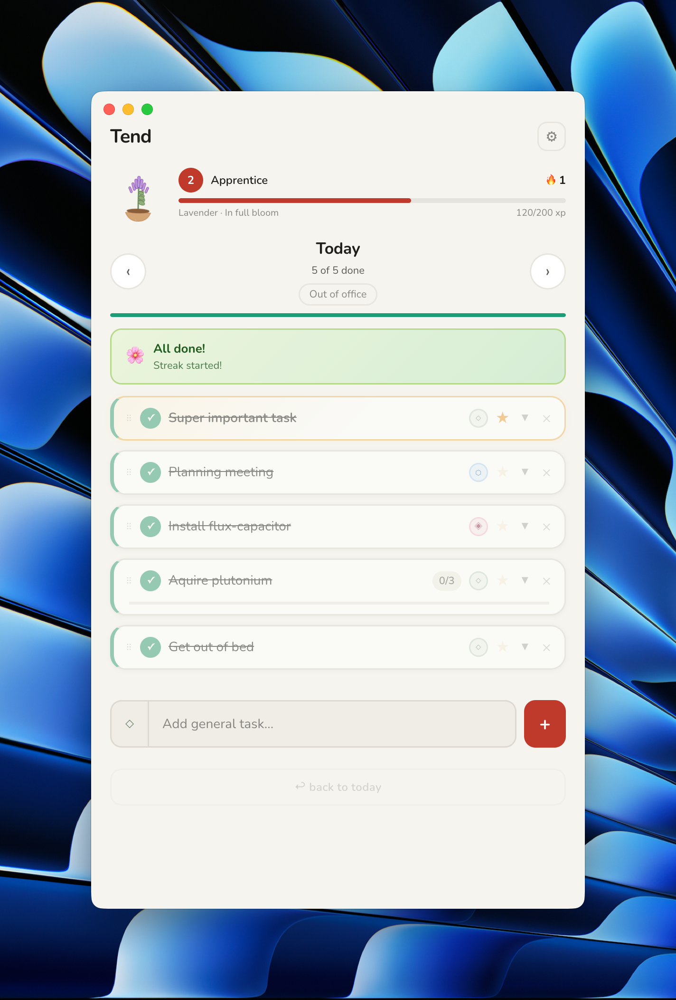
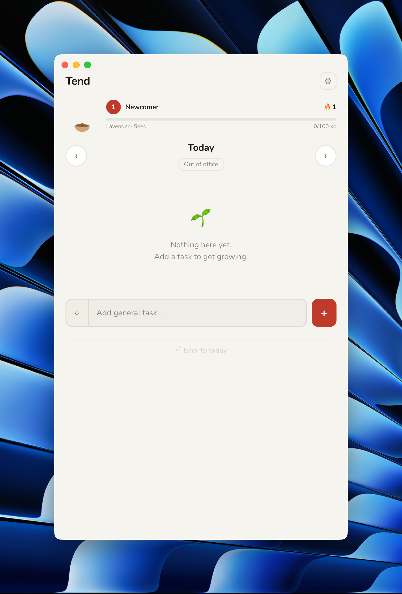
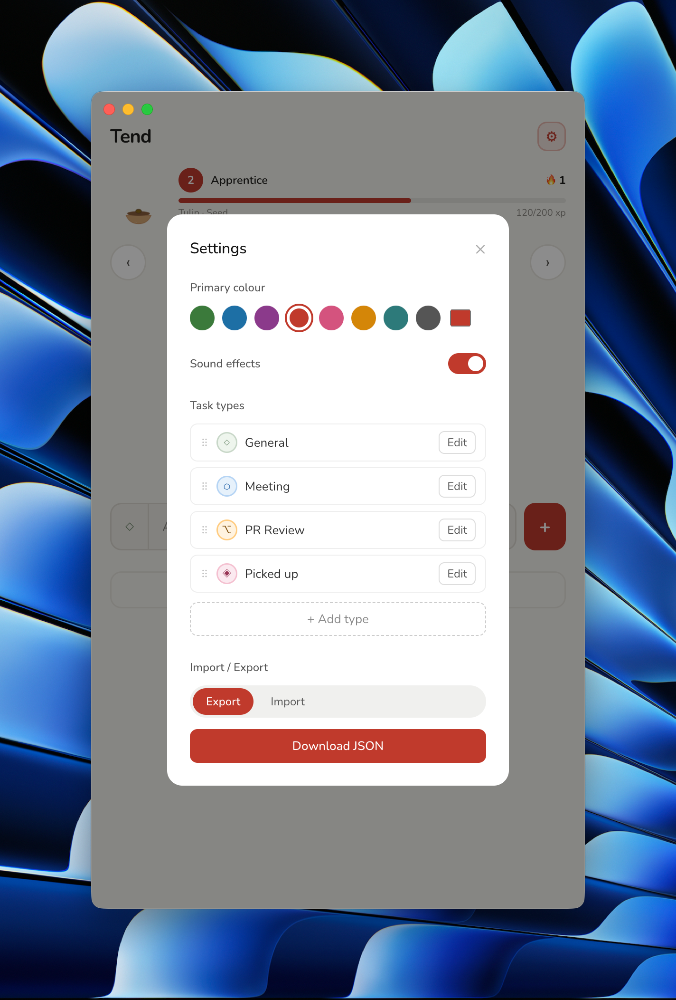

# Tend

A daily task manager with a gentle twist — complete your tasks and watch your flower grow. Built with Next.js and
packaged as a cross-platform desktop app via Electron.

**Features**

- Satisfying design and sound effects
- Daily task lists organised by workday
- Subtasks, task types, importance flagging, and link attachments
- XP and levelling system with a progressive XP curve and combo multipliers
- Day streak tracking
- Drag-and-drop reordering
- Customisable accent colour and task types
- JSON import/export
- All data stored locally — no account, no server

## Screenshots

|                                            |                                  |                                        |
|--------------------------------------------|----------------------------------|----------------------------------------|
|          |  |  |
|  |  |                                        |

## Download

Pre-built installers are attached to each [GitHub Release](../../releases):

| Platform              | File                    |
|-----------------------|-------------------------|
| macOS (Apple Silicon) | `.dmg`                  |
| Windows               | `.exe` (NSIS installer) |
| Linux                 | `.AppImage`             |

### macOS — "damaged" error

The app is unsigned. macOS will block it with a "damaged" message. To fix this, run the following command in Terminal **after** moving Tend to your Applications folder:

```bash
xattr -cr /Applications/Tend.app
```

Then try opening it again. This removes the quarantine flag macOS adds to files downloaded from the internet.

## Running locally (web)

```bash
npm install
npm run dev
```

Open [http://localhost:3000](http://localhost:3000).

## Running locally (desktop)

```bash
npm install
npm run electron:dev
```

This starts the Next.js dev server and opens Electron pointing at it. Hot reload works as normal.

## Building a desktop app

```bash
npm run electron:build
```

Produces a platform-native installer in `dist/`. The Next.js app is exported as a static site and bundled into the
Electron package.

## Releases

Releases are built automatically via GitHub Actions when a new release is created on GitHub. All three platforms build
in parallel and upload their installers to the release.

To cut a release:

1. Bump `"version"` in `package.json` and push
2. Create a GitHub release with a matching tag (e.g. `v1.2.0`)
3. GitHub Actions builds and attaches the installers automatically

## Contributing

Contributions are welcome. Please open an issue before starting significant work so we can discuss the approach.

```bash
# Fork the repo, then:
git clone https://github.com/<your-username>/daily-tasks
cd daily-tasks
npm install
npm run dev
```

### Project structure

| Path                            | Description                                            |
|---------------------------------|--------------------------------------------------------|
| `app/page.tsx`                  | Main application — all state and logic lives here      |
| `app/components/`               | UI components (TaskCard, flowers, particles, modals)   |
| `app/lib/`                      | Constants, date utilities, localStorage, sound effects |
| `app/types.ts`                  | Shared TypeScript types                                |
| `electron/main.js`              | Electron main process                                  |
| `.github/workflows/release.yml` | CI release workflow                                    |

### Code style

- No test suite is configured — manual testing is expected for UI changes
- Keep components focused; avoid abstractions for one-off use cases
- Sound effects go in `app/lib/sfx.ts`; new visual styles in `app/components/styles.ts`

## License

MIT
